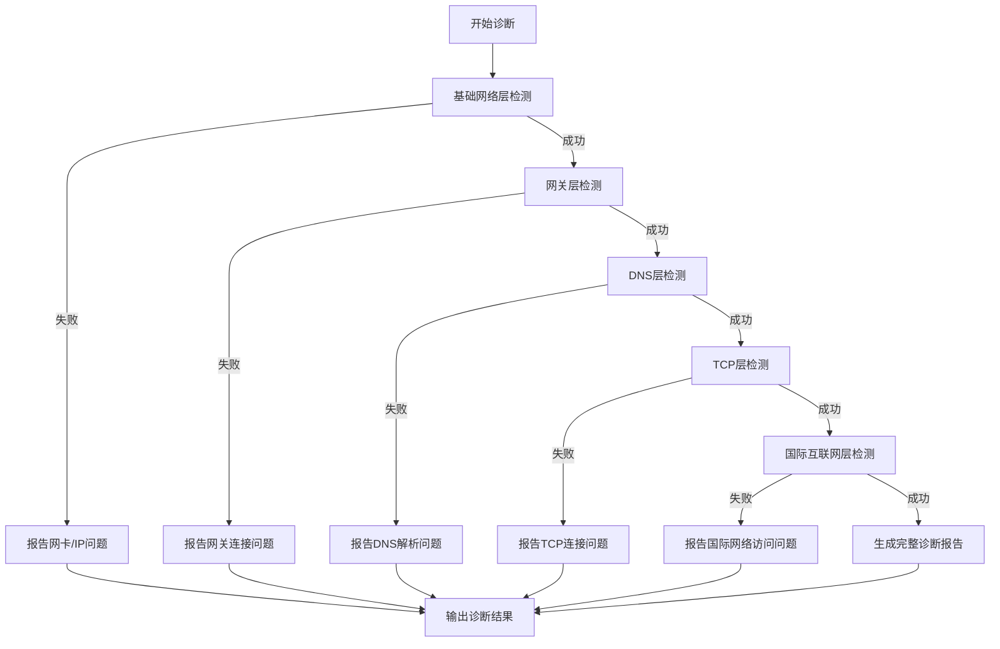

# oh-my-network
一个多层次网络诊断工具，用于全面检测和分析网络连接问题。

## 使用方法

```bash
go run main.go [-proxy string]
```

参数说明：
- `-proxy`: 可选，指定代理服务器地址

## 网络诊断流程


```mermaid
graph TD
    A[开始诊断] --> B[基础网络层检测]
    B --> |成功| C[网关层检测]
    B --> |失败| B1[报告网卡/IP问题]
    C --> |成功| D[DNS层检测]
    C --> |失败| C1[报告网关连接问题]
    D --> |成功| E[TCP层检测]
    D --> |失败| D1[报告DNS解析问题]
    E --> |成功| F[国际互联网层检测]
    E --> |失败| E1[报告TCP连接问题]
    F --> |成功| G[生成完整诊断报告]
    F --> |失败| F1[报告国际网络访问问题]
    B1 --> H[输出诊断结果]
    C1 --> H
    D1 --> H
    E1 --> H
    F1 --> H
    G --> H
```