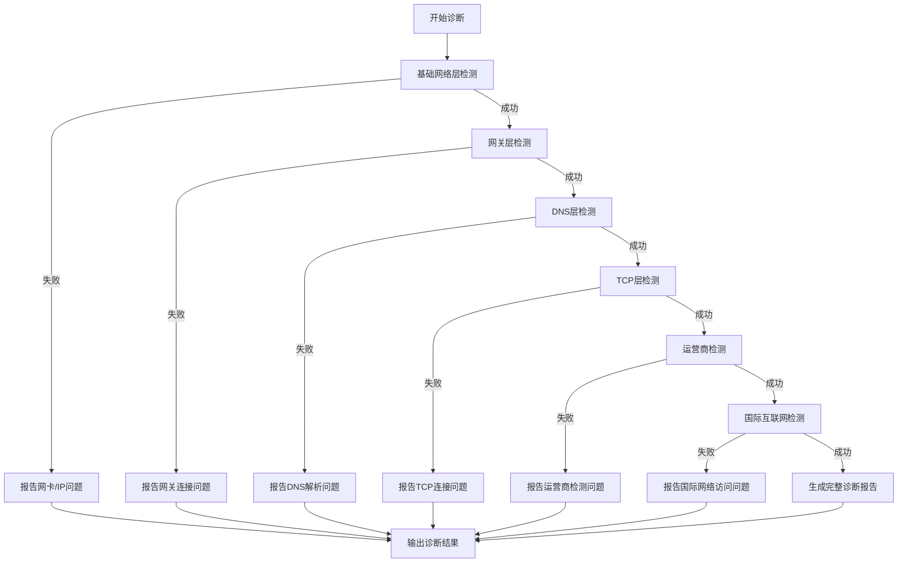

# Oh My Network

[](https://golang.org/doc/devel/release.html)
[](https://opensource.org/licenses/MIT)

网络诊断工具，检测你的网络连接状态并给出评估报告。

> 简单来说就是排查为什么你连了WIFI或者开了热点但访问不到互联网。

## 功能特点

- 多层次网络诊断
  - 基础网络层：检测网络接口状态和本地IP配置
  - 网关层：检测网关连接状态
  - DNS解析层：检测多个DNS服务器的可用性和响应时间
  - TCP连接层：检测常用网站的TCP连接状态
  - 运营商层：检测网络运营商信息和公网IP
  - 国际互联网：检测国际网站的连接状态和延迟

- 详细的诊断报告
  - 彩色命令行输出，清晰展示检测进度和结果
  - 支持导出详细的文本报告和原始数据
  - 自动创建带时间戳的报告目录

## 使用示例

1. 基本诊断
```bash
go run main.go
```

2. 导出诊断报告
```bash
go run main.go -o outputs
```

3. 使用代理服务器
```bash
go run main.go -proxy http://127.0.0.1:7890
```

## 诊断报告示例

```powershell
网络诊断工具启动
开始进行多层次网络诊断...

[INFO] 开始网络诊断
[INFO] 开始网络诊断
[SUCCESS] 找到有效网络接口: vEthernet (WSL), IP: 172.25.224.1
[SUCCESS] 基础网络检测完成 - 状态: 正常
[SUCCESS] 网关检测完成 - 状态: 正常, 网关地址: 192.168.131.144
[SUCCESS] DNS检测完成 - 状态: 正常
[SUCCESS] TCP检测完成 - 状态: 正常
[SUCCESS] 运营商检测完成 - 状态: 正常, 运营商: 中国移动, IP: 2409:891f:5c43:a094:e153:2e15:b5b6:118f, 组织: Shanghai Mobile Communications Co.,Ltd.
[SUCCESS] 国际互联网检测完成 - 状态: 正常

网络诊断报告
==================================================
检测时间: 2025-02-10 02:26:49

总体状态
------------------------------
诊断结果: 正常
最后成功层级: 国际互联网层

基础网络信息
------------------------------
本地IP: 172.25.224.1
网关地址: 192.168.131.144
DNS服务器: 114.114.114.114, 8.8.8.8, 1.1.1.1
运营商: 中国移动
公网IP: 2409:891f:5c43:a094:8dd9:260e:489c:a9c5
```

## 诊断检测流程



## 输出说明

1. 命令行输出
    - 使用彩色文本展示检测进度和状态
    - 实时显示各层检测结果
    - 清晰标识成功/失败状态

2. 诊断报告
    - 保存在指定输出目录的时间戳子目录中
    - 包含 network_diagnosis.txt（可读报告）
    - 包含 raw_data.json（原始数据）